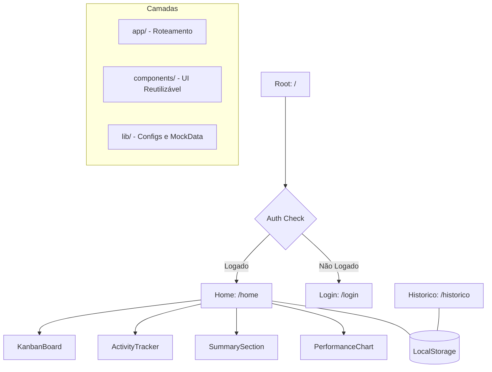

# Rumo 🎯

[]()
[]()
[]()
[]()

> "Direção clara, vida leve."

**Rumo** é uma plataforma de produtividade de alta fidelidade focada em transparência e progresso real. O sistema utiliza uma interface premium e reativa para gerenciar objetivos, tarefas ativas (Kanban) e análise de desempenho em tempo real.

---

## 🚀 Quick Start (Copy-Paste)

Inicie o projeto localmente em menos de 2 minutos:

```bash
# Clone e entre na pasta
# Instale as dependências
npm install --legacy-peer-deps

# Rode em modo desenvolvedor
npm run dev
```

O projeto estará disponível em `http://localhost:3000`.

---

## 🏗️ Architecture Graph

A arquitetura do Rumo segue o padrão do Next.js App Router, com separação clara entre a lógica de persistência local e os componentes de interface.



---

## 🔗 Environment Variables

Atualmente, o projeto não exige variáveis de ambiente externas, pois a persistência é feita via **LocalStorage**.

| Key | Description | Required | Output |
|-----|-------------|----------|--------|
| `NODE_ENV` | Ambiente de execução | N | `development` / `production` |

---

## 📂 Index de Funcionalidades

Abaixo estão os links para as documentações específicas de cada módulo principal:

1. [🏠 Dashboard (Home)](file:///c:/Users/guilh/rumo/app/home/README.md) - Gestão ativa de tarefas e analytics.
2. [📜 Histórico](file:///c:/Users/guilh/rumo/app/historico/README.md) - Retrospectiva de tarefas concluídas.
3. [🔑 Login](file:///c:/Users/guilh/rumo/app/login/README.md) - Fluxo de autenticação e onboarding.

---

### 🛠️ Stack Tecnológica

- **Core**: Next.js 16, React 19, TypeScript.
- **UI/UX**: Tailwind CSS 4, Radix UI, Framer Motion (Transições Fluidas).
- **Gráficos**: Recharts.
- **Validação**: Zod + React Hook Form.

---
© 2026 Rumo Project.
