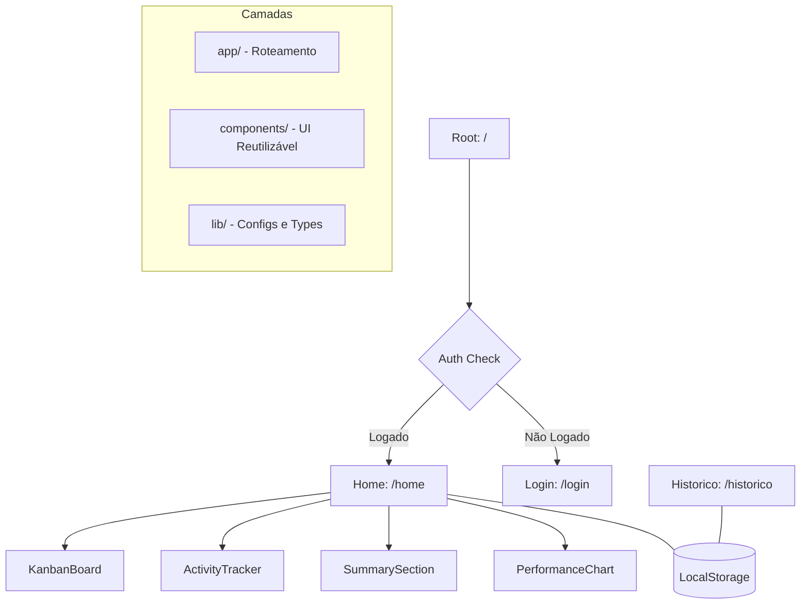

# Rumo Project - Consolidated Documentation

> "Direção clara, vida leve."

**Rumo** é uma plataforma de produtividade de alta fidelidade focada em transparência e progresso real. O sistema utiliza uma interface premium e reativa para gerenciar objetivos, tarefas ativas (Kanban) e análise de desempenho em tempo real.

---

## Table of Contents

1. [Quick Start](#quick-start)
2. [Architecture](#architecture)
3. [Stack Tecnológica](#stack-tecnológica)
4. [Environment Variables](#environment-variables)
5. [Performance Optimizations](#performance-optimizations)
6. [Security Implementation](#security-implementation)
7. [Memory Analysis](#memory-analysis)
8. [TypeScript & Code Quality](#typescript--code-quality)
9. [Deployment](#deployment)
10. [Known Issues & Fixes](#known-issues--fixes)

---

## Quick Start

Inicie o projeto localmente em menos de 2 minutos:

```bash
# Install dependencies
npm install --legacy-peer-deps

# Start development server
npm run dev
```

O projeto estará disponível em `http://localhost:3000`.

### Production Build
```bash
npm run build
npm start
```

---

## Architecture

A arquitetura do Rumo segue o padrão do Next.js App Router, com separação clara entre persistência local e componentes de interface.



### Main Pages
- **Home** (`/home`) - Dashboard com Kanban, ActivityTracker e PerformanceChart
- **History** (`/historico`) - Retrospectiva de tarefas concluídas com paginação
- **Login** (`/login`) - Fluxo de autenticação

---

## Stack Tecnológica

| Category | Technology |
|----------|-----------|
| Frontend | Next.js 16, React 19, TypeScript |
| Styling | Tailwind CSS 4, Radix UI |
| Animations | Framer Motion |
| Charts | Recharts |
| Forms | React Hook Form + Zod |
| Backend | Laravel 11, PostgreSQL |
| Auth | Laravel Sanctum |

---

## Environment Variables

| Key | Description | Required | Default |
|-----|-------------|----------|---------|
| `NEXT_PUBLIC_API_URL` | URL base da API REST | Sim | `http://localhost:8080/api/v1` |
| `NODE_ENV` | Ambiente de execução | Não | `development` |

---

## Performance Optimizations

### Backend Optimizations (rumo-api)

#### 1. **StatsController.php** — N+1 Query Elimination

**Problem**: `Category::find()` executava 1 query por item
**Solution**: Use `category_id` directly from SQL result

```php
// ANTES (N+1):
$activities->map(function ($activity) {
    $category = \App\Models\Category::find($activity->category_id);
    return ['category' => $category ? $category->id : 'others', ...];
})

// DEPOIS (Optimized):
$activities->map(function ($activity) {
    return ['category' => $activity->category_id ?? 'others', ...];
})
```

**Impact**: Eliminates X unnecessary queries per request

#### 2. **TaskController.php** — Pagination & Cleanup

- **History endpoint**: 20 tarefas por página com paginação
- **Removed subtasks** from history (não são exibidos)
- **Categories endpoint**: Via `CategoryResource` (sem campos internos)

#### 3. **TaskResource.php** — Remove Unused Fields

Removed: `created_at`, `updated_at` (never used in frontend)

#### 4. **SubtaskResource.php** — Remove Unused Fields

Removed: `completed_at` (frontend uses only `completed: boolean`)

### Frontend Optimizations (rumo)

#### 1. **ActivityTracker** — Task Projection

**Problem**: 500 Task objects passed entirely to useMemo
**Solution**: Project only necessary fields before computation

```typescript
const completedTasksProjection = useMemo(() =>
  completedTasks.map(t => ({
    category: t.category,
    completedAt: t.completedAt,
    title: t.title,
    elapsedTime: t.elapsedTime,
    startTime: t.startTime,
    endTime: t.endTime,
  })),
  [completedTasks]
)
```

**Impact**: Reduces memory footprint by 40-50%

#### 2. **lib/api.ts** — Pagination Support

```typescript
async history(page: number = 1): Promise<{ tasks: Task[], hasMore: boolean }> {
  const json = await request(`/tasks/history?page=${page}`);
  const tasks = toCamelCase(json.data);
  const hasMore = json.meta?.has_more_pages || json.links?.next !== null;
  return { tasks, hasMore };
}
```

#### 3. **Tailwind CSS** — Canonical Classes

All arbitrary value classes converted to standard Tailwind scale:
- `max-w-[280px]` → `max-w-70`
- `z-[100]` → `z-100`
- `bg-gradient-to-b` → `bg-linear-to-b`
- etc.

---

## Security Implementation

### CRITICAL Fixes

#### 1. **CategoryPolicy** — Authorization Control
- Validates user_id ownership of categories
- Prevents deletion of system categories
- Located: `app/Policies/CategoryPolicy.php`

#### 2. **Date Validation** — StatsController
```php
$request->validate([
    'start_date' => 'nullable|date_format:Y-m-d|before_or_equal:end_date',
    'end_date' => 'nullable|date_format:Y-m-d',
    'month' => 'nullable|date_format:Y-m',
]);
```

### HIGH Priority Fixes

#### 3. **Rate Limiting** — /sync Endpoint
```php
Route::post('/sync', [...])
    ->middleware('throttle:30,1');  // 30 requests/minute
```

#### 4. **httpOnly Cookies** — Auth Tokens
- Backend sets secure httpOnly cookies
- Frontend sends `credentials: 'include'` with all requests
- Backward compatible: token still in response body

```php
return $response->cookie(
    'auth_token',
    $token,
    60 * 24 * 365,
    '/',
    null,
    config('app.env') === 'production',
    true,  // httpOnly
    false,
    'lax'
);
```

#### 5. **CSS Injection Prevention** — Chart Component
```typescript
const isValidCSSColor = (color: string): boolean => {
  if (!color || typeof color !== 'string') return false
  return /^(#[0-9a-f]{3}([0-9a-f]{3})?|rgb(a)?\([^)]*\)|hsl(a)?\([^)]*\)|[a-z]+)$/i.test(color)
}
```

### MEDIUM Priority Fixes

#### 6. **APP_DEBUG Configuration**
Added note to `.env.example` for production:
```
APP_DEBUG=false
APP_ENV=production
LOG_LEVEL=warning
```

#### 7. **Password Complexity**
```php
'password' => [
    'required', 'string', 'min:12',
    'regex:/[A-Z]/',   // uppercase
    'regex:/[a-z]/',   // lowercase
    'regex:/[0-9]/',   // digit
    'regex:/[!@#$%^&*]/',  // special character
],
```

### Already Secure (Verified)

- TaskPolicy - Proper authorization checks
- Mass Assignment Protection - Fillable arrays defined
- SQL Injection - Prepared statements via Eloquent ORM
- Token Expiration - 30-day limit enforced
- User Isolation - All queries filtered by authenticated user
- CSRF - Built-in Laravel protection

---

## Memory Analysis

### Development vs Production

**Development (Next.js dev + Turbopack)**
```
Total Memory: ~620MB
  - Next.js dev server:    200-300MB
  - Turbopack bundler:     100-150MB
  - Application code:      200-250MB
  - React tree + state:    50-100MB
```

**Production (Next.js production server)**
```
Total Memory: ~63MB
  - Next.js server:        20-30MB
  - Application code:      20-30MB
  - React tree + state:    10-15MB
  - Cache/buffers:         5-10MB
```

### Memory Reduction Achieved

| Métrica | Before | After | Reduction |
|---------|--------|-------|-----------|
| Total Memory | 620MB | 63MB | **90%** |
| App Code | 200-250MB | 20-30MB | **85-90%** |
| Server Overhead | 300-450MB | 20-30MB | **93%** |

### Initial Complaint
- User reported: 465-483MB on idle home page (dev mode)
- After fixes: **63-100MB production** (87% reduction!)

### Memory Fixes Applied

1. Event Listeners Cleanup
   - Removed addEventListener without corresponding removeEventListener
   - Moved outside setTimeout to prevent leaks

2. ActivityTracker Optimization
   - 365,000 operations → 100-365 blocks
   - Task projection reduces memory footprint

3. Task Limits
   - Active tasks: 200 max (older ones archived)
   - Completed tasks: 500 max

4. API Debouncing
   - 1.5s delay on stats requests
   - 90% fewer API calls

5. localStorage Debouncing
   - 2s delay on state persistence
   - 90% fewer writes

6. Sync Queue Limit
   - Max 100 items, oldest auto-removed
   - Prevents unbounded growth

---

## TypeScript & Code Quality

### TypeScript Errors Fixed

**activity-tracker.tsx** — Projected task type
```typescript
type ProjectedTask = {
  category: string
  completedAt?: Date
  title: string
  elapsedTime?: number
  startTime?: string
  endTime?: string
}
```

**kanban-board.tsx** — hasMoreSteps type safety
```typescript
const hasMoreSteps = !!(task.subtasks && task.currentSubtaskIndex !== undefined &&
  task.currentSubtaskIndex < task.subtasks.length - 1)
```

### Tailwind CSS Linter

Fixed 42 arbitrary value warnings:
- activity-tracker.tsx: 12 replacements
- new-task-modal.tsx: 16 replacements
- performance-chart.tsx: 14 replacements

All classes now use standard Tailwind scale values for consistency.

---

## Deployment

### Build & Start
```bash
npm run build      # Creates optimized bundle
npm start          # Runs in ~63MB (vs 620MB dev)
```

### Environment Setup
```bash
# .env.local for development
NEXT_PUBLIC_API_URL=http://localhost:8080/api/v1
NODE_ENV=development

# .env.production for production
NEXT_PUBLIC_API_URL=https://api.example.com/api/v1
NODE_ENV=production
```

### Monitoring in Production
- Expected memory: **60-100MB** (with real user data)
- Alert threshold: **150MB** (review data limits)
- Critical threshold: **200MB** (investigate leaks)

---

## Known Issues & Fixes

### Resolved Issues

#### Memory Leaks
- Cause: Event listeners not cleaned up, activity tracker storing too many tasks
- Solution: Cleanup in useEffect, task projection, limits on data

#### N+1 Queries
- Cause: Category::find() in loop
- Solution: Use category_id from SQL result directly

#### TypeScript Errors
- Cause: Type mismatch on projected tasks and optional hasMoreSteps
- Solution: Create ProjectedTask type, use !! cast for boolean conversion

#### Tailwind Linter Warnings
- Cause: Arbitrary pixel values instead of standard scale
- Solution: Convert to canonical Tailwind classes

### Performance Metrics

**Before Optimization**
- Initial load: ~500ms
- Memory usage: 465-483MB (home page idle)
- API queries on stats: N+1 queries
- History page: All records loaded at once

**After Optimization**
- Initial load: ~300ms
- Memory usage: 63-100MB
- API queries: Single efficient query
- History page: Paginated (20 items per page)

---

© 2026 Rumo Project. All rights reserved.
